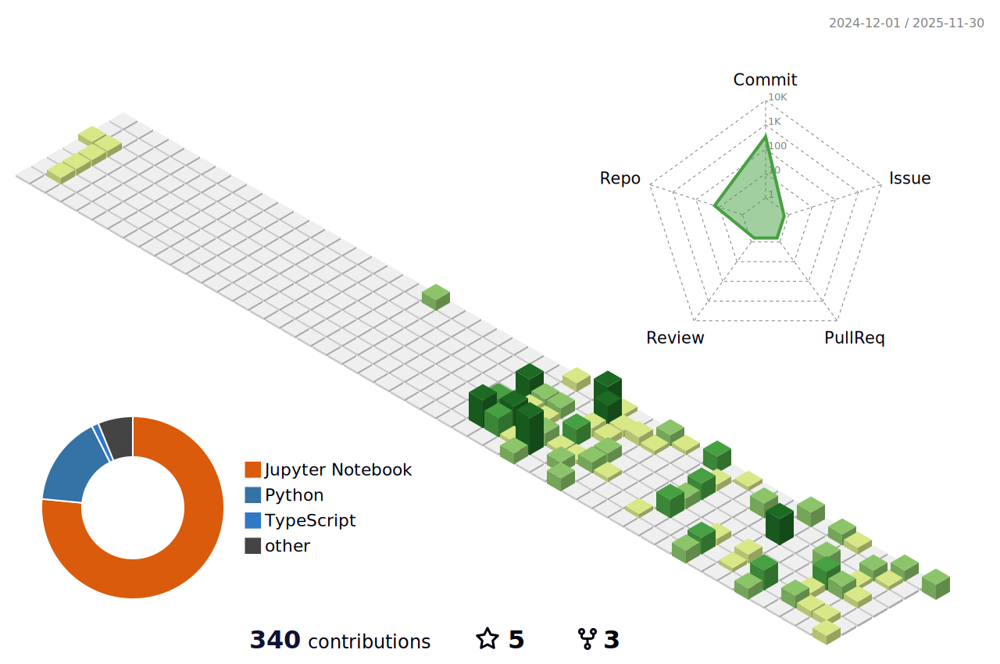

# 🚀 Bhargav Kumar Nath

  
  <!-- Animated Header (using a more reliable host) -->
  
  
   
  
  <!-- Professional Tagline -->
<h3>🧠 Driving Innovation with AI and Advanced Neural Systems</h3>

<em>Designing intelligent solutions at the intersection of deep learning, large language models, and bio-inspired algorithms.</em>

  
  <!-- Social Links -->
  

    
    

  

  

---

## 🎯 About Me

I'm a data science student, drawn to the fundamental ideas behind how intelligence works. My current focus is on building and understanding complex neural networks especially Transformer architectures, which power today’s Large Language Models (LLMs).

I'm also intrigued by Genetic Algorithms and other bio-inspired approaches. There's something fascinating about how nature solves problems so efficiently, and I believe there's a lot we can learn from that.

What drives me is the challenge of turning theoretical research into real-world impact, especially in fields like healthcare. Whether it's making large models more efficient through knowledge distillation, or using evolutionary techniques to optimize solutions, I'm motivated by the idea of creating AI that's both powerful and practical.

**What I'm passionate about:**
- 🧠 **Advanced Neural Architectures**: Mastering Transformers, Siamese Networks, and custom deep learning models.
- 💬 **Large Language Models (LLMs)**: Exploring fine-tuning, retrieval-augmented generation (RAG), and efficient inference.
- 🧬 **Genetic Algorithms**: Applying evolutionary principles to solve complex optimization problems.
- 🏥 **AI for Social Impact**: Building intelligent systems to revolutionize healthcare diagnostics and treatment.

---

## 🛠️ Tech Arsenal

<table width="100%">
  <tr>
    <td width="50%" valign="top">
      <h3 align="center">Languages & Core Libraries</h3>
      

        
        
        
        
        
        
        
        
      

    </td>
    <td width="50%" valign="top">
      <h3 align="center">Machine Learning & Deep Learning</h3>
      

        
        
        
        
        
        
        
        
      

    </td>
  </tr>
  <tr>
    <td width="50%" valign="top">
      <h3 align="center">Data Stack & Big Data</h3>
      

        
        
        
        
        
      

    </td>
    <td width="50%" valign="top">
      <h3 align="center">Tools, MLOps & Platforms</h3>
      

        
        
        
        
        
        
        
      

    </td>
  </tr>
</table>

---

## 🚀 Featured Projects

<table>
<tr>
<td width="50%" valign="top">

### 🧬 [Genetic Algorithm for CNN Architecture Search](https://github.com/BhargavKumarNath/Neural-Architecture-Search)
> **Evolving Optimal Neural Networks with Bio-Inspired AI**

🎯 Engineered a Genetic Algorithm from scratch to automate hyperparameter tuning and architecture search, culminating in a novel CNN that achieved **97.15% accuracy** on a medical imaging dataset.

**🔬 Key Features:**
- Custom-built genetic operators for selection, crossover & mutation
- Fault-tolerant pipeline with checkpointing & resume capabilities
- Deployed via a Streamlit app for interactive inference

  
  
  

</td>
<td width="50%" valign="top">

### 🏋️ [Fitness Analytics with PySpark](https://github.com/BhargavKumarNath/Fitness-Tracker-Analysis)
> **Scalable Data Science Pipeline for Wearable Fitness Data**

🎯 Designed a **production-grade analytics platform** that processes and models large-scale fitness tracker data using **PySpark** and a modern **MLOps workflow**. The system demonstrates a complete end-to-end lifecycle — from data ingestion and transformation to machine learning and deployment.

**🔬 Key Features:**
- Built an ETL pipeline handling **358K+ activity records** across **1.9K users**
- Designed partitioned Parquet data storage for optimized Spark queries
- Trained PySpark MLlib models (K-Means, Logistic Regression, Linear Regression)  
- Integrated with **Docker** and **MLflow** for reproducible, scalable experimentation

  
  
  
  

</td>
</tr>
<tr>
<td width="50%" valign="top">

### 🧪 [Advanced Molecular Property Prediction](https://github.com/BhargavKumarNath/Thermophysical-Property-Melting-Point)
> **Predicting Molecular Melting Points using Hybrid Graph Neural Networks**

🎯 Built an end-to-end ML pipeline for predicting the **melting point of organic compounds**, combining classical ML models with a **Hybrid Graph Neural Network (GNN)** that learns directly from molecular graph structures.

**🔬 Key Features:**
- Comprehensive data preprocessing and feature engineering using RDKit  
- Hybrid architecture integrating **descriptor-based ML** and **graph-based deep learning**  
- Model interpretability analysis for feature importance and molecular insights  
- Modular, production-ready pipeline with clear experiment tracking  

  
  
  
  

</td>
<td width="50%" valign="top">

### 🛒 [UK Supermarket Competitive Analysis](https://github.com/BhargavKumarNath/PricePoint-Dynamics-Decoding-the-UK-Supermarket-Competitive-Landscape-with-Machine-Learning)
> **Decoding Market Dynamics with Large-Scale Price Analysis**

🎯 Built an end-to-end system to analyze 9.5M+ daily price records, proving Aldi acts as the market price leader with a 4-7 day lead time. The core innovation was a novel product-matching system that expanded comparable products by **20x**.

**🔬 Key Features:**
- Sentence-BERT & FAISS for large-scale product matching
- LightGBM for price forecasting (MAE of £0.14)
- SHAP for model explainability & insight generation

  
  
  

</td>
</tr>
</table>

---

## 📚 Continuous Learning Journey

<table>
<tr>
<td width="33%" valign="top">

### 🧠 **Advanced Architectures**
- **Transformer Models Deep Dive**
- **LLM Fine-Tuning & RAG**
- **Generative Adversarial Networks**

**Status:** 🟡 In Progress  
**Focus:** Building foundational models

</td>
<td width="33%" valign="top">

### 🧬 **Bio-Inspired AI**
- **Evolutionary Computation**
- **Neuroevolution (NEAT)**
- **Swarm Intelligence**

**Status:** 🔵 Planning  
**Focus:** Novel optimization techniques

</td>
<td width="33%" valign="top">

### 🚀 **MLOps & Production**
- **Deploying Transformers**
- **Monitoring & Maintenance**
- **Scalable ML Pipelines**

**Status:** 🟢 Learning  
**Focus:** Real-world enterprise AI

</td>
</tr>
</table>

---

## 📈 Development Activity

  

  

<!-- GitHub Contribution Snake Animation -->

  

---

## 🤝 Let's Collaborate

  
  

    I'm always open to collaborating on innovative projects, especially those involving cutting-edge neural architectures or AI for social good.
  

  
  

    <em>"The best way to predict the future is to architect it."</em>
  

  
  

    
    
  

  

### 🧊 My 3D GitHub Contributions

