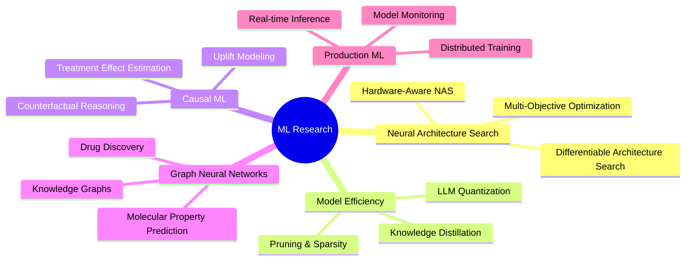

# 👋 Bhargav Kumar Nath

<div align="center">
  
  <!-- Dynamic Typing Animation -->
  
  
  <br/>
  <br/>
  
  <!-- Professional Tagline with Gradient -->
  
  
  <h2>🧠 ML Engineer & Data Scientist</h2>
  <p><em>Architecting intelligent systems at the intersection of optimization theory, deep learning, and production engineering</em></p>
  
  <br/>
    
  <!-- Social Links with Modern Styling -->
  <p>
    <a href="https://www.linkedin.com/in/bhargavkumarnath/">
      
    </a>
    <a href="mailto:bhargavkumarnathh@gmail.com">
      
    </a>
    <a href="https://portfolio-sepia-nine-51.vercel.app/">
      
    </a>
  </p>
  
</div>

---

## 🎯 About Me

```python
class MLEngineer:
    def __init__(self):
        self.name = "Bhargav Kumar Nath"
        self.role = "ML Engineer & Researcher"
        self.education = "MSc Data Science & Analytics @ University of Leeds"
        self.location = "Leeds, UK 🇬🇧"
        
    def current_focus(self):
        return {
            "research": [
                "Hardware-Aware Neural Architecture Search (NAS)",
                "LLM Quantization & Mixed-Precision Training",
                "Causal ML & Heterogeneous Treatment Effects",
                "Graph Neural Networks for Molecular Property Prediction"
            ],
            "engineering": [
                "Production ML Systems with Apache Spark",
                "MLOps: Docker, MLflow, CI/CD Pipelines",
                "Real-time Inference Optimization",
                "Distributed Training & Model Serving"
            ]
        }
    
    def philosophy(self):
        return """
        Building ML systems that work reliably in production, not just in notebooks.
        Bridging the gap between cutting-edge research and scalable engineering.
        """
```

<details>
<summary><b>📖 My Journey in ML (Click to expand)</b></summary>
<br/>

I'm drawn to the fundamental questions behind intelligence and optimization. My work spans the full ML lifecycle, from theoretical research in neural architecture search and causal inference to production engineering of scalable data pipelines.

**What excites me:**
- 🧬 **Evolutionary Computation**: Using genetic algorithms and neuroevolution to discover optimal architectures
- 🎯 **Causal Inference**: Moving beyond correlation to understand true treatment effects in decision systems
- ⚡ **Model Efficiency**: Compressing LLMs through quantization and mixed-precision techniques without sacrificing accuracy
- 🔬 **Scientific ML**: Applying GNNs to drug discovery and molecular property prediction
- 🚀 **Production Systems**: Building fault-tolerant, distributed ML pipelines that scale

Recently completed my Master's at the University of Leeds, where I specialized in advanced optimization techniques, causal modeling, and large-scale data engineering. Now seeking roles where I can contribute to impactful ML systems at the intersection of research and production.

</details>

---

## 🔥 Featured Projects

<div align="center">

### 🏆 Flagship Research & Engineering Work

</div>

<table>
<tr>
<td width="50%" valign="top">

<div align="center">
  
### 🧬 [Evolutionary Mixed-Precision Architecture Search (EMPAS)](https://github.com/BhargavKumarNath/EMPAS)


</div>

**Research Contribution:** Novel hardware-aware NAS framework reducing LLM VRAM by **45%** while maintaining **99% accuracy** of FP16 baselines.

**Key Innovations:**
- 🧠 Hessian-guided evolutionary optimization for sensitivity-aware quantization
- ⚡ Mixed-precision search space (FP16/INT8/INT4) with hardware cost modeling
- 🎯 Multi-objective fitness: accuracy × memory × latency
- 🔄 Fault-tolerant checkpointing system for long-running searches

**Tech Stack:**  
`PyTorch` `Genetic Algorithms` `Model Compression` `Streamlit`

**Impact:** Enables edge deployment of large models on resource-constrained devices.

<div align="center">

[](https://github.com/BhargavKumarNath/EMPAS)
[](https://evolutionary-mixed-precision-search.streamlit.app/)

</div>

</td>
<td width="50%" valign="top">

<div align="center">
  
### 📊 [Causal Inference Platform for Marketing Optimization](https://github.com/BhargavKumarNath/A-B-Testing)


</div>

**Research Contribution:** Unified experimentation engine estimating **Heterogeneous Treatment Effects (HTE)** to optimize marketing ROI.

**Key Innovations:**
- 🎯 X-Learner & Meta-Learner implementations for CATE estimation
- 🎰 Multi-Armed Bandit integration for adaptive experimentation
- 📈 Uplift curve visualization for treatment effect stratification
- 💰 Cost-benefit analysis identifying high-incrementality users

**Tech Stack:**  
`Python` `Causal Inference` `Hypothesis Testing` `Bayesian Statistics`

**Impact:** Reduces wasted ad spend by targeting users with highest causal lift.

<div align="center">

[](https://github.com/BhargavKumarNath/A-B-Testing)
[](https://github.com/BhargavKumarNath/A-B-Testing)

</div>

</td>
</tr>
<tr>
<td width="50%" valign="top">

<div align="center">
  
### 🧪 [Graph Neural Networks for Drug Discovery](https://github.com/BhargavKumarNath/Thermophysical-Property-Melting-Point)


</div>

**Research Contribution:** State-of-the-art molecular property prediction using hybrid GNN architecture learning directly from molecular graphs.

**Key Innovations:**
- 🔬 Message-passing GNN capturing bond topology & electron distribution
- 🧬 Multi-stage stacking ensemble (GNN + XGBoost + Descriptor-based models)
- 📊 RDKit feature engineering: fingerprints, descriptors, substructure counts
- 🎯 SHAP-based molecular insights for model interpretability

**Tech Stack:**  
`PyTorch Geometric` `RDKit` `Cheminformatics` `Ensemble Learning`

**Impact:** Accelerates drug discovery by predicting thermophysical properties without wet-lab experiments.

<div align="center">

[](https://github.com/BhargavKumarNath/Thermophysical-Property-Melting-Point)
[](https://thermophysical-property-melting-point.streamlit.app/)

</div>

</td>
<td width="50%" valign="top">

<div align="center">
  
### 🏋️ [Production ML Pipeline with Apache Spark](https://github.com/BhargavKumarNath/Fitness-Tracker-Analysis)


</div>

**Engineering Excellence:** Enterprise-grade ML system processing **358K+ activity records** from **1.9K+ users** with production MLOps workflow.

**Key Features:**
- ⚡ PySpark ETL pipeline with optimized Parquet partitioning
- 🔄 Dockerized environment for reproducible experimentation
- 📊 MLflow integration for experiment tracking & model registry
- 🎯 98% classification accuracy using distributed ML (PySpark MLlib)
- 🚀 Feature engineering at scale: rolling aggregates, window functions

**Tech Stack:**  
`Apache Spark` `Docker` `MLflow` `Signal Processing` `Time Series`

**Impact:** Demonstrates production-ready data engineering & scalable ML workflows.

<div align="center">

[](https://github.com/BhargavKumarNath/Fitness-Tracker-Analysis)
[](https://fitness-tracker-analysis.streamlit.app/)

</div>

</td>
</tr>
<tr>
<td width="50%" valign="top">

<div align="center">
  
### 🌌 [MALLORN: Rare Event Detection in Astronomy](https://github.com/BhargavKumarNath/MALLORN-Astronomical-Classification-Challenge)


</div>

**Research Contribution:** Multi-channel RNN pipeline detecting rare Tidal Disruption Events (TDEs) in LSST survey data with **1:1000 class imbalance**.

**Key Innovations:**
- 📡 Multi-channel architecture processing 6 photometric bands simultaneously
- 🔄 GRU-based sequence modeling for time-series astronomical data
- ⚖️ Advanced class balancing: SMOTE-ENN, focal loss, threshold tuning
- 🎯 High recall for rare events while maintaining precision

**Tech Stack:**  
`PyTorch (RNN/GRU)` `Signal Processing` `Imbalanced Learning` `Astronomy`

**Impact:** Enables early detection of transient phenomena for follow-up observation campaigns.

<div align="center">

[](https://github.com/BhargavKumarNath/MALLORN-Astronomical-Classification-Challenge)
[](https://mallorn-astronomical-classification-challenge.streamlit.app/)

</div>

</td>
<td width="50%" valign="top">

<div align="center">
  
### 🎭 [Synthetic Intelligence: Privacy-Preserving Data Generation](https://github.com/BhargavKumarNath/Synthetic-Intelligence)


</div>

**Research Contribution:** Generative framework for tabular data synthesis achieving near-perfect distribution alignment (<2% utility loss) while preserving privacy.

**Key Innovations:**
- 🔐 CTGAN & Gaussian Copula for high-fidelity synthetic data
- 📊 Statistical validation: KS tests, correlation preservation, PCA analysis
- 🎯 Solves class imbalance & cold-start problems for rare events
- 🔒 Privacy guarantees: no training data leakage, differential privacy metrics

**Tech Stack:**  
`PyTorch` `Generative Modeling` `SDV Library` `Privacy Engineering`

**Impact:** Enables data sharing for ML without compromising sensitive information.

<div align="center">

[](https://github.com/BhargavKumarNath/Synthetic-Intelligence)
[](https://synthetic-intelligence.streamlit.app/)

</div>

</td>
</tr>
</table>

<div align="center">

### 📚 Additional Projects

</div>

<details>
<summary><b>🔍 Click to view more projects</b></summary>
<br/>

<table>
<tr>
<td width="50%">

**🛒 [UK Supermarket Competitive Intelligence](https://github.com/BhargavKumarNath/PricePoint-Dynamics-Decoding-the-UK-Supermarket-Competitive-Landscape-with-Machine-Learning)**

Analyzed 9.5M+ daily prices proving Aldi as market price leader with 4-7 day lead time.

**Innovations:**
- Sentence-BERT & FAISS for scalable product matching (20x expansion)
- LightGBM price forecasting (MAE £0.14)
- SHAP analysis revealing pricing strategies

`NLP` `Time Series` `LightGBM` `SHAP`

</td>
<td width="50%">

**🧬 [Neural Architecture Search with Genetic Algorithms](https://github.com/BhargavKumarNath/Neural-Architecture-Search)**

Evolutionary CNN optimization achieving 97.15% accuracy on medical imaging.

**Innovations:**
- Custom genetic operators: selection, crossover, mutation
- Fault-tolerant checkpointing system
- Streamlit deployment for inference

`Genetic Algorithms` `AutoML` `PyTorch` `Medical Imaging`

</td>
</tr>
</table>

</details>

---

## 🛠️ Technical Arsenal

<div align="center">

### Core Competencies

</div>

```yaml
Machine Learning:
  Deep Learning: "PyTorch, TensorFlow, Keras | CNN, RNN, Transformers, GNN"
  Classical ML: "Scikit-Learn, XGBoost, LightGBM | Ensemble Methods, Feature Engineering"
  Specialized: "Causal Inference, Uplift Modeling, Neural Architecture Search, Model Compression"
  
Data Engineering:
  Big Data: "Apache Spark (PySpark), Hadoop | Distributed Processing at Scale"
  Databases: "PostgreSQL, SQL | Query Optimization, Data Modeling"
  Formats: "Parquet, CSV, JSON | Efficient Storage & Retrieval"
  
MLOps & Production:
  Containerization: "Docker, Docker Compose | Reproducible Environments"
  Experiment Tracking: "MLflow, Weights & Biases | Versioning & Registry"
  Deployment: "Streamlit, FastAPI | Model Serving & Monitoring"
  Version Control: "Git, GitHub | CI/CD Workflows"

Programming Languages:
  Expert: "Python (NumPy, Pandas, Matplotlib, Seaborn)"
  Proficient: "SQL, R, TypeScript, JavaScript"
  
Specialized Libraries:
  Scientific: "RDKit (Cheminformatics), OpenCV (Computer Vision)"
  NLP: "Hugging Face Transformers, Sentence-BERT, FAISS"
  Optimization: "Optuna, Ray Tune | Hyperparameter Optimization"
  Statistics: "Statsmodels, SciPy | Hypothesis Testing, Causal Inference"
```

<details>
<summary><b>🎨 Tech Stack Visualization (Click to expand)</b></summary>
<br/>

<div align="center">

### 🐍 Languages & Core Tools


### 🤖 Machine Learning & Deep Learning


### 📊 Data Engineering & Big Data


### 🔧 MLOps & DevOps


### 🚀 Deployment & Visualization


### 🔬 Specialized Libraries


</div>

</details>

---

## 📈 GitHub Analytics

<div align="center">

 

</div>

<div align="center">
  
  <!-- Contribution Snake Animation -->
  
  
</div>

<div align="center">


</div>

---

## 🎓 Research & Writing

<div align="center">

### 📝 Technical Blog Posts

</div>

<table>
<tr>
<td width="50%">

<div align="center">

**[The Evolution of Artificial Intelligence: From Symbolic AI to Deep Learning](https://www.leedsfinsights.com/post/the-evolution-of-artificial-intelligence-from-symbolic-ai-to-deep-learning)**

</div>

A comprehensive journey through AI's transformation from rule-based expert systems to modern neural architectures. Explores the paradigm shifts that enabled today's breakthroughs.

🏷️ `AI History` `Deep Learning` `Neural Networks`

</td>
<td width="50%">

<div align="center">

**[Beyond the Hill: The Modern Algorithm's Quest for Global Optima](https://www.leedsfinsights.com/post/beyond-the-hill-the-modern-algorithm-s-quest-for-global-optima)**

</div>

Deep dive into optimization landscapes, comparing gradient-based methods with evolutionary strategies. Practical insights for escaping local minima in neural architecture search.

🏷️ `Optimization` `Genetic Algorithms` `Gradient Descent`

</td>
</tr>
</table>

---

## 💼 Professional Experience

<table>
<tr>
<td width="50%" valign="top">

### 📊 Data Analyst Intern
**Airports Authority of India** | Jul 2023 – Aug 2023

- 🔍 Analyzed lifecycle data across **1,053 IT assets**, identifying failure patterns to optimize maintenance schedules
- 📉 Statistical evaluation of procurement workflows revealing **15-20% reduction** in administrative overhead
- 🎯 Data quality assessment for SAP ERP integration covering **19,000+ employee records**

**Impact:** Reduced unplanned downtime through predictive maintenance insights

</td>
<td width="50%" valign="top">

### 💻 Software Development Intern
**IIT Guwahati** | Jul 2023 – Aug 2023

- 📋 Built rule-based scheduling algorithm in Node.js automating timetable generation with constraint handling
- 🔍 Competitive analysis of 4+ applications, benchmarking features to guide product roadmap
- 📊 Qualitative analysis of user surveys to extract pain points for feature engineering

**Impact:** Reduced scheduling conflicts and improved system efficiency

</td>
</tr>
</table>

---

## 🎯 Current Learning & Research Interests

<div align="center">



</div>

<table>
<tr>
<td width="33%" valign="top">

### 🧠 Advanced Neural Architectures
**Current Focus:**
- Transformer optimization techniques
- Vision-Language models
- Multimodal learning

**Status:** 🟢 Active Research  
**Goal:** Novel architectures for resource-constrained environments

</td>
<td width="33%" valign="top">

### 🔬 Scientific Machine Learning
**Current Focus:**
- Physics-informed neural networks
- Molecular dynamics simulation
- Drug-target interaction prediction

**Status:** 🟡 Exploration Phase  
**Goal:** Accelerate scientific discovery with ML

</td>
<td width="33%" valign="top">

### 🚀 MLOps at Scale
**Current Focus:**
- Kubernetes for ML
- Feature stores (Feast)
- Model observability

**Status:** 🔵 Learning  
**Goal:** Deploy enterprise-grade ML systems

</td>
</tr>
</table>

---

## 🏆 Achievements & Metrics

<div align="center">

<table>
<tr>
<td align="center">
<h3>45%</h3>
<p><b>VRAM Reduction</b></p>
<p><em>LLM Quantization via EMPAS</em></p>
</td>
<td align="center">
<h3>358K+</h3>
<p><b>Records Processed</b></p>
<p><em>Production Spark Pipeline</em></p>
</td>
<td align="center">
<h3>9.5M+</h3>
<p><b>Price Records Analyzed</b></p>
<p><em>Market Intelligence System</em></p>
</td>
<td align="center">
<h3>98%</h3>
<p><b>Classification Accuracy</b></p>
<p><em>Time-Series Sensor Data</em></p>
</td>
</tr>
<tr>
<td align="center">
<h3>97.15%</h3>
<p><b>CNN Accuracy</b></p>
<p><em>Genetic Algorithm NAS</em></p>
</td>
<td align="center">
<h3><2%</h3>
<p><b>Utility Loss</b></p>
<p><em>Synthetic Data Generation</em></p>
</td>
<td align="center">
<h3>20x</h3>
<p><b>Product Matching Expansion</b></p>
<p><em>Sentence-BERT + FAISS</em></p>
</td>
<td align="center">
<h3>1:1000</h3>
<p><b>Class Imbalance Solved</b></p>
<p><em>Rare Astronomical Events</em></p>
</td>
</tr>
</table>

</div>