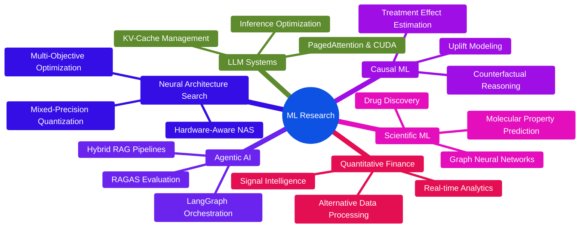

<div align="center">


<br/>


<br/><br/>

<a href="https://www.linkedin.com/in/bhargavkumarnath/">
  
</a>&nbsp;
<a href="mailto:bhargavkumarnathh@gmail.com">
  
</a>&nbsp;
<a href="https://portfolio-sepia-nine-51.vercel.app/">
  
</a>&nbsp;


<br/><br/>


</div>

---

## 🎯 About Me

```python
class MLEngineer:
    def __init__(self):
        self.name             = "Bhargav Kumar Nath"
        self.role             = "ML Engineer & Systems Researcher"
        self.education        = {
            "masters"  : "MSc Data Science & Analytics @ University of Leeds (2024–2025)",
            "bachelors": "BTech Computer Science @ Assam Don Bosco University (2020–2024)",
        }
        self.location         = "Leeds, UK 🇬🇧"
        self.projects_shipped = 11
        self.seeking          = "Full-time ML / Data Science roles"

    def current_focus(self):
        return {
            "systems_engineering": [
                "LLM Inference Optimization — PagedAttention in Rust + CUDA",
                "Agentic RAG Pipelines — LangGraph, Qdrant, RAGAS",
                "High-Throughput Signal Intelligence for Quant Finance",
                "100M+ Event Pipelines with DuckDB + Polars",
            ],
            "research": [
                "Hardware-Aware Neural Architecture Search (NAS)",
                "Mixed-Precision LLM Quantization & Model Compression",
                "Causal ML & Heterogeneous Treatment Effects",
                "Graph Neural Networks for Molecular Property Prediction",
            ],
        }

    def philosophy(self) -> str:
        return (
            "A model is a mathematical fantasy, but an ML system is a living entity.\n"
            "I design for the shifting reality of the human world,\n"
            "not the static perfection of a laboratory."
        )
```

<details>
<summary><b>📖 My Journey in ML (Click to expand)</b></summary>
<br/>

My path started with hands-on data engineering work and grew into a deep obsession with the boundary between research and production. I ship things that work — in real data centres, on commodity hardware, under real latency constraints.

**What drives me:**
- ⚡ **Systems Performance** — Pushing hardware to its limits: PagedAttention in Rust, CUDA kernels, KV-cache optimization achieving 8–32× throughput gains
- 🤖 **Agentic AI** — Building reliable LLM pipelines that reason, retrieve, and act with verifiable faithfulness scores (0.91 on RAGAS)
- 🎯 **Causal Intelligence** — Moving beyond A/B testing to true treatment effect estimation, identifying micro-segments driving 70% of total uplift
- 🔬 **Scientific ML** — Applying GNNs and hybrid architectures to accelerate material science and drug discovery
- 📊 **Quantitative Finance** — Designing signal intelligence platforms for real-time algorithmic trading decisions

**Three Core Principles:**
1. **Escape the State-of-the-Art Trap** — Leaderboard victories rarely survive reality. Establish honest baselines first.
2. **Data Over Algorithms** — Architectures come and go; long-term success depends on data quality and distribution understanding.
3. **Deployment as the Starting Line** — A shipped model needs continuous monitoring to stay reliable. Production is where the real work begins.

Currently completing my MSc at the University of Leeds, specializing in advanced ML, big data architecture, and MLOps. Actively seeking full-time opportunities to build impactful ML systems.

</details>

---

## 🔥 Featured Projects

<div align="center">

### 🏆 Flagship Engineering & Research Work

</div>

<table>
<tr>
<td width="50%" valign="top">

<div align="center">

### ⚡ [PageForge — LLM Inference Engine](https://github.com/BhargavKumarNath/PageForge)


</div>

**Systems Achievement:** Memory management system for LLM inference implementing PagedAttention — achieving **8–32× throughput improvement** (424 sequences/GB vs. 53) by eliminating up to 90% VRAM waste from pre-allocated KV caches.

**Key Innovations:**
- 🦀 PagedAttention paging engine written in **Rust** with Python bindings via **PyO3**
- ⚡ **CUDA** kernels via **CuPy** for high-performance attention computation
- 📐 Non-contiguous block layout eliminating memory fragmentation
- 🔄 Zero-copy interface for streaming decode

**Tech Stack:**  
`Rust` `CUDA` `Python` `PyO3` `CuPy` `PagedAttention`

**Impact:** Enables serving larger batch sizes on constrained hardware — bridging research-grade LLMs and edge deployment.

<div align="center">

[](https://github.com/BhargavKumarNath/PageForge)
[](https://page-forge-five.vercel.app/)

</div>

</td>
<td width="50%" valign="top">

<div align="center">

### 📡 [Andria Systems — Signal Intelligence Platform](https://github.com/BhargavKumarNath/Andria-Systems)


</div>

**Engineering Achievement:** High-throughput signal intelligence platform for quantitative hedge funds — enabling **sub-second signal extraction** from fragmented high-velocity alternative data streams for real-time algorithmic trading decisions.

**Key Features:**
- 📊 Unified ingestion layer normalizing heterogeneous alternative data streams
- ⚡ Sub-second latency signal extraction pipeline
- 🔍 Pattern recognition across multi-source financial signals
- 🎯 Clean analyst-facing dashboard built with **Next.js + React**

**Tech Stack:**  
`Next.js` `React` `Signal Processing` `Financial Analytics` `Alternative Data`

**Impact:** Gives quant analysts a single pane of glass for real-time market intelligence.

<div align="center">

[](https://github.com/BhargavKumarNath/Andria-Systems)
[](https://andria-systems.vercel.app/)

</div>

</td>
</tr>
<tr>
<td width="50%" valign="top">

<div align="center">

### 🧬 [EMPAS — Evolutionary Mixed-Precision Architecture Search](https://github.com/BhargavKumarNath/Evolutionary-Mixed-Precision-Architecture-Search)


</div>

**Research Contribution:** Hardware-aware NAS framework reducing LLM VRAM by **40%** with a **20% throughput gain** — compressing evolutionary search time from days to minutes on TinyLlama-1.1B.

**Key Innovations:**
- 🧠 Hessian-guided evolutionary optimization for sensitivity-aware quantization
- ⚡ Mixed-precision search space (FP16/INT8/INT4) with hardware cost modeling
- 🎯 Multi-objective fitness: accuracy × memory × latency
- 🔄 Fault-tolerant checkpointing for long-running evolutionary searches

**Tech Stack:**  
`PyTorch` `CUDA` `Genetic Algorithms` `Model Compression` `Streamlit`

**Impact:** Enables edge deployment of large models on resource-constrained devices.

<div align="center">

[](https://github.com/BhargavKumarNath/Evolutionary-Mixed-Precision-Architecture-Search)
[](https://evolutionary-mixed-precision-search.streamlit.app/)

</div>

</td>
<td width="50%" valign="top">

<div align="center">

### 🤖 [FinSight-Alpha — Agentic RAG for Finance](https://github.com/BhargavKumarNath/FinSightAlpha)


</div>

**Engineering Achievement:** Production agentic RAG pipeline for financial document analysis — achieving **0.91 faithfulness score** on RAGAS and **+56% F1 improvement** over naive retrieval.

**Key Innovations:**
- 🔍 Hybrid retrieval: dense (**Qdrant**) + sparse retrieval for maximum recall
- 🧠 **LangGraph** orchestration with strict tool-execution constraints
- 📊 **RAGAS** evaluation framework for continuous faithfulness monitoring
- 🎯 Financial domain reasoning with hallucination guardrails

**Tech Stack:**  
`LangGraph` `Qdrant` `Python` `RAGAS` `Hybrid Retrieval`

**Impact:** Reduces analyst time on document review with verifiably accurate, grounded answers.

<div align="center">

[](https://github.com/BhargavKumarNath/FinSightAlpha)
[](https://finsightalpha.streamlit.app/)

</div>

</td>
</tr>
<tr>
<td width="50%" valign="top">

<div align="center">

### 🏪 [Customer Intelligence Platform](https://github.com/BhargavKumarNath/Customer-Intelligence-Platform)


</div>

**Engineering Achievement:** Analytics system processing **109.9M event logs on commodity hardware** — achieving **97% memory reduction** (14.7 GB → 1.9 GB) and **4.5× conversion lift** via propensity-modeled targeting.

**Key Innovations:**
- 🦆 **DuckDB + Polars** in-process analytics replacing heavyweight Spark for sub-100M workloads
- 📉 97% memory footprint reduction via columnar storage + lazy evaluation
- 🎯 LightGBM propensity modeling revealing high-conversion micro-segments
- 📊 Uplift curves + SHAP attribution for interpretable targeting decisions

**Tech Stack:**  
`DuckDB` `Polars` `LightGBM` `Propensity Modeling` `Python`

**Impact:** Enterprise-scale behavioral analytics on a laptop — no cluster required.

<div align="center">

[](https://github.com/BhargavKumarNath/Customer-Intelligence-Platform)
[](https://customer-intelligence-platform.streamlit.app/)

</div>

</td>
<td width="50%" valign="top">

<div align="center">

### 📊 [Dynamic Experimentation Engine](https://github.com/BhargavKumarNath/A-B-Testing)


</div>

**Research Contribution:** Unified causal experimentation engine estimating **Heterogeneous Treatment Effects (HTE)** — achieving **<1ms inference latency** and identifying micro-segments driving **70% of total uplift** (+$0.14/user).

**Key Innovations:**
- 🎯 X-Learner & Meta-Learner implementations for CATE estimation
- 🎰 Thompson Sampling (Multi-Armed Bandit) for adaptive allocation
- ⚡ Knowledge distillation for sub-millisecond production inference
- 📈 Uplift curve visualization for treatment effect stratification

**Tech Stack:**  
`CausalML` `X-Learners` `Thompson Sampling` `Knowledge Distillation` `Python`

**Impact:** Reduces wasted spend by targeting users with highest causal lift.

<div align="center">

[](https://github.com/BhargavKumarNath/A-B-Testing)
[](https://ablytics.streamlit.app/)

</div>

</td>
</tr>
</table>

<details>
<summary><b>🔍 More Projects — Click to Expand</b></summary>
<br/>

<table>
<tr>
<td width="50%">

**🛒 [PricePoint Dynamics — UK Supermarket Intelligence](https://github.com/BhargavKumarNath/PricePoint-Dynamics-Decoding-the-UK-Supermarket-Competitive-Landscape-with-Machine-Learning)**

Competitive intelligence system analyzing 9.5M+ daily prices across 67,000+ products. MAE £0.139 (R²=0.98), proving Aldi as market price leader with 4–7 day lead time.

- Sentence-BERT + FAISS for scalable product matching (20× expansion)
- LightGBM price forecasting + SHAP strategy analysis

`NLP` `FAISS` `LightGBM` `SHAP` `Time Series`

[](https://pricepoint.streamlit.app/)

</td>
<td width="50%">

**🌌 [MALLORN — Rare Transient Detection in Astronomy](https://github.com/BhargavKumarNath/MALLORN-Astronomical-Classification-Challenge)**

Multi-channel RNN pipeline detecting rare Tidal Disruption Events at 4.86% class prevalence. **+197% F1 improvement** over GRU baseline (0.53 F1 score).

- 6-band photometric processing + tsfresh feature engineering
- SMOTE-ENN + focal loss for extreme class imbalance

`PyTorch RNN/GRU` `tsfresh` `LightGBM` `Signal Processing`

[](https://mallorn-astronomical-classification-challenge.streamlit.app/)

</td>
</tr>
<tr>
<td width="50%">

**🎭 [Synthetic Intelligence — Privacy-Preserving Data Generation](https://github.com/BhargavKumarNath/Synthetic-Intelligence)**

Generative tabular data framework with **+5.1% AUPRC over SMOTE** and linear O(N) complexity via model-driven rejection sampling with manifold alignment guarantees.

- PyTorch autoencoders + CTGAN for high-fidelity synthesis
- Differential privacy metrics + t-SNE distribution validation

`PyTorch` `CTGAN` `SDV Library` `Privacy AI` `t-SNE`

[](https://synthetic-intelligence.streamlit.app/)

</td>
<td width="50%">

**🧪 [Melting Point Prediction — Hybrid GNN Architecture](https://github.com/BhargavKumarNath/Thermophysical-Property-Melting-Point)**

GNN + XGBoost fusion for thermodynamic property prediction. **20% MAE reduction** vs. pure deep learning, <50ms latency (24.59K MAE).

- Message-passing GNN + RDKit descriptor feature fusion
- Optuna hyperparameter optimization + SHAP interpretability

`PyTorch Geometric` `RDKit` `Optuna` `XGBoost`

[](https://thermophysical-property-melting-point.streamlit.app/)

</td>
</tr>
<tr>
<td width="50%">

**🏋️ [Fitness Tracker — Production Spark ML Pipeline](https://github.com/BhargavKumarNath/Fitness-Tracker-Analysis)**

Enterprise ML system processing 358K+ records from 1.9K+ users. **98% classification accuracy** with 198 FFT-derived temporal features and 98% data compression.

- PySpark ETL + MLflow experiment tracking + Docker
- Signal Processing: FFT/PCA for noisy sensor data

`Apache Spark` `Docker` `MLflow` `Signal Processing` `PySpark MLlib`

[](https://fitness-tracker-analysis.streamlit.app/)

</td>
<td width="50%">

**🧬 [Neural Architecture Search — Genetic Algorithms](https://github.com/BhargavKumarNath/Neural-Architecture-Search)**

Evolutionary CNN optimization achieving **97.15% accuracy** on medical imaging via custom genetic operators: selection, crossover, and mutation with fault-tolerant checkpointing.

- Automated architecture search without gradient information
- Streamlit deployment for real-time inference

`Genetic Algorithms` `AutoML` `PyTorch` `Medical Imaging`

</td>
</tr>
<tr>
<td width="50%">

**🧠 [Deep Learning Lab — Interactive TypeScript Engine](https://github.com/BhargavKumarNath/DeepLearningLab)**

Dependency-free mathematical neural network engine built from scratch in TypeScript for hands-on hyperparameter experimentation with live training noise injection.

- Zero-dependency backpropagation from first principles
- Real-time loss visualization + noise injection for robustness testing

`TypeScript` `Neural Networks` `From Scratch` `Interactive`

</td>
<td width="50%">

**📊 [UK Supermarket Competitive Intelligence — Extended Analysis](https://github.com/BhargavKumarNath/PricePoint-Dynamics-Decoding-the-UK-Supermarket-Competitive-Landscape-with-Machine-Learning)**

Deep-dive into pricing strategy dynamics across major UK supermarket chains with causal analysis of competitor response patterns and Granger causality testing.

- Time-series Granger causality for price leadership detection
- Demand elasticity modeling across product categories

`Econometrics` `Granger Causality` `Demand Modeling` `Python`

</td>
</tr>
</table>

</details>

---

## 🛠️ Technical Arsenal

```yaml
Languages:
  Systems:          "Rust · C · Bash/Shell"
  Data Science:     "Python · R · SQL"
  Frontend:         "TypeScript · JavaScript"

Machine Learning:
  Deep Learning:    "PyTorch · Keras | CNN · RNN · Transformers · GNN"
  Classical ML:     "Scikit-Learn · XGBoost · LightGBM | Ensemble Methods"
  Specialized:      "CausalML · Uplift Modeling · NAS · Model Compression · Agentic AI"

High Performance Computing:
  GPU:              "CUDA · CuPy · TensorRT · PyO3 (Rust-Python bindings)"
  Inference:        "PagedAttention · KV-Cache Optimization · Mixed-Precision (FP16/INT8/INT4)"

LLM & Agentic AI:
  Frameworks:       "LangGraph · LangChain · Hugging Face Transformers"
  Vector DBs:       "Qdrant · FAISS | Hybrid Retrieval"
  Evaluation:       "RAGAS · Sentence-BERT | Faithfulness · Relevance · Groundedness"

Data Engineering:
  Big Data:         "Apache Spark (PySpark) · Hadoop · Apache Kafka · Airflow"
  In-Process:       "DuckDB · Polars · Pandas · NumPy"
  Databases:        "PostgreSQL · Redis · MySQL"
  Formats:          "Parquet · Arrow · JSON"

MLOps & Cloud:
  Containerization: "Docker · Kubernetes"
  Tracking:         "MLflow · Weights & Biases"
  Cloud:            "AWS · GCP"
  Serving:          "FastAPI · Streamlit · Next.js · React"
  CI/CD:            "GitHub Actions"

Specialized:
  Cheminformatics:  "RDKit · PyTorch Geometric · OpenCV"
  Optimization:     "Optuna · Ray Tune · Genetic Algorithms · Hessian Analysis"
  Statistics:       "Statsmodels · SciPy · Bayesian Inference · Hypothesis Testing"
```

<details>
<summary><b>🎨 Full Tech Stack Badges — Click to Expand</b></summary>
<br/>

<div align="center">

**Languages & Core**


**ML & Deep Learning**


**LLM & Agentic AI**


**High Performance Computing**


**Data Engineering**


**MLOps & Cloud**


**Deployment & Frontend**


**Specialized Libraries**


</div>

</details>

---

## 📈 GitHub Analytics

<div align="center">


</div>

<div align="center">


</div>

---

## 💼 Professional Experience

<table>
<tr>
<td width="33%" valign="top">

### 📊 Data Analyst
**M/S Sanjog Trading**  
Jul 2020 – Nov 2021 · Guwahati, India

- 🏗️ Architected end-to-end ETL infrastructure with Pandas & NumPy for operational data pipelines
- 📈 Developed statistical time-series forecasting models for sales optimization
- 📊 Engineered interactive Streamlit dashboards for KPI visualization and pricing strategy

**Impact:** Built first production data pipelines, translating raw business data into actionable pricing intelligence

</td>
<td width="33%" valign="top">

### 💻 Data Engineering Intern
**IIT Guwahati**  
Jul 2022 – Aug 2022 · Guwahati, India

- 📋 Designed normalized MySQL schemas with ACID-compliant optimization for academic data systems
- 🔍 Built heuristic constraint-satisfaction algorithm for automated timetable generation
- 📊 Conducted quantitative user research across institutions and EdTech competitive analysis

**Impact:** Reduced scheduling conflicts and improved operational efficiency for academic planning systems

</td>
<td width="33%" valign="top">

### 📡 Data Analyst Intern
**Airports Authority of India**  
Jul 2023 – Aug 2023 · NER Regional HQ, India

- 🔍 Analyzed lifecycle data across **1,053 IT assets**, identifying failure patterns to optimize maintenance
- 🗺️ Mapped enterprise network infrastructure: MPLS/ILL load balancing, core switching, firewalls
- 🎯 Data quality assessment for SAP ERP integration covering **19,000+ employee records**

**Impact:** Predictive maintenance insights enabling proactive asset lifecycle management

</td>
</tr>
</table>

---

## 🎯 Research Frontiers

<div align="center">


```mermaid
%%{init: {
  "theme": "base",
  "themeVariables": {
    "primaryColor": "#7aa2f7",
    "primaryTextColor": "#ffffff",
    "primaryBorderColor": "#7dcfff",
    "lineColor": "#e0af68",
    "secondaryColor": "#9ece6a",
    "tertiaryColor": "#bb9af7",
    "fontSize": "18px"
  }
}}%%
mindmap
  root((ML Research))
    LLM Systems
      PagedAttention & CUDA
      Inference Optimization
      KV-Cache Management
    Agentic AI
      LangGraph Orchestration
      Hybrid RAG Pipelines
      RAGAS Evaluation
    Neural Architecture Search
      Hardware-Aware NAS
      Mixed-Precision Quantization
      Multi-Objective Optimization
    Causal ML
      Uplift Modeling
      Treatment Effect Estimation
      Counterfactual Reasoning
    Scientific ML
      Graph Neural Networks
      Molecular Property Prediction
      Drug Discovery
    Quantitative Finance
      Signal Intelligence
      Alternative Data Processing
      Real-time Analytics
```

</div>

<table>
<tr>
<td width="33%" valign="top">

### ⚡ LLM Systems & Inference
**Current Focus:**
- PagedAttention & KV-cache paging
- Mixed-precision kernel design
- Speculative decoding techniques

**Status:** 🟢 Active Engineering  
**Goal:** Sub-linear memory scaling for long-context LLM serving

</td>
<td width="33%" valign="top">

### 🤖 Agentic AI & RAG
**Current Focus:**
- Multi-agent orchestration patterns
- Retrieval faithfulness guarantees
- Tool-use with verification loops

**Status:** 🟢 Active Engineering  
**Goal:** Production-grade agentic pipelines with measurable reliability

</td>
<td width="33%" valign="top">

### 🔬 Scientific & Causal ML
**Current Focus:**
- Physics-informed neural networks
- Drug-target interaction prediction
- Counterfactual policy evaluation

**Status:** 🟡 Exploration Phase  
**Goal:** Accelerate scientific discovery and causal decision systems

</td>
</tr>
</table>

---

## 🎓 Research & Writing

<div align="center">

### 📝 Technical Publications — LeedsFINsights

</div>

<table>
<tr>
<td width="33%">

<div align="center">

**[The Evolution of Artificial Intelligence: From Symbolic AI to Deep Learning](https://www.leedsfinsights.com/post/the-evolution-of-artificial-intelligence-from-symbolic-ai-to-deep-learning)**

</div>

A comprehensive journey through AI's transformation from rule-based expert systems to modern neural architectures. Traces the paradigm shifts that enabled today's breakthroughs.

🏷️ `AI History` `Deep Learning` `Neural Networks`

</td>
<td width="33%">

<div align="center">

**[Beyond the Hill: The Modern Algorithm's Quest for Global Optima](https://www.leedsfinsights.com/post/beyond-the-hill-the-modern-algorithm-s-quest-for-global-optima)**

</div>

Comparing gradient-based methods with evolutionary strategies for escaping local minima. Practical insights from neural architecture search.

🏷️ `Optimization` `Genetic Algorithms` `Gradient Descent`

</td>
<td width="33%">

<div align="center">

**[ESG in the Age of AI: Why the Stakes Have Never Been Higher](https://www.leedsfinsights.com/post/esg-in-the-age-of-ai-why-the-stakes-have-never-been-higher)**

</div>

Examining the intersection of AI advancement and environmental, social, and governance accountability in an era of accelerating compute demands.

🏷️ `AI Ethics` `ESG` `Responsible AI`

</td>
</tr>
</table>

---

## 🏆 Achievements & Impact

<div align="center">

<table>
<tr>
<td align="center" width="25%">
<h2>8–32×</h2>
<b>Throughput Gain</b><br/>
<em>LLM Inference — PageForge</em>
</td>
<td align="center" width="25%">
<h2>109.9M</h2>
<b>Events Processed</b><br/>
<em>Customer Intelligence Platform</em>
</td>
<td align="center" width="25%">
<h2>4.5×</h2>
<b>Conversion Uplift</b><br/>
<em>Propensity Modeling</em>
</td>
<td align="center" width="25%">
<h2>97%</h2>
<b>Memory Reduction</b><br/>
<em>DuckDB + Polars Pipeline</em>
</td>
</tr>
<tr>
<td align="center" width="25%">
<h2>0.91</h2>
<b>Faithfulness Score</b><br/>
<em>Agentic RAG — FinSight</em>
</td>
<td align="center" width="25%">
<h2>40%</h2>
<b>VRAM Reduction</b><br/>
<em>LLM Quantization — EMPAS</em>
</td>
<td align="center" width="25%">
<h2>&lt;1ms</h2>
<b>Inference Latency</b><br/>
<em>Experimentation Engine</em>
</td>
<td align="center" width="25%">
<h2>+197%</h2>
<b>F1 Improvement</b><br/>
<em>Rare Transient Detection</em>
</td>
</tr>
<tr>
<td align="center" width="25%">
<h2>11</h2>
<b>Projects Shipped</b><br/>
<em>End-to-end ML Systems</em>
</td>
<td align="center" width="25%">
<h2>9.5M+</h2>
<b>Price Records Analyzed</b><br/>
<em>Market Intelligence System</em>
</td>
<td align="center" width="25%">
<h2>+56%</h2>
<b>F1 vs. Naive RAG</b><br/>
<em>FinSight-Alpha</em>
</td>
<td align="center" width="25%">
<h2>97.15%</h2>
<b>CNN Accuracy</b><br/>
<em>Genetic Algorithm NAS</em>
</td>
</tr>
</table>

</div>

---

<div align="center">


</div>
